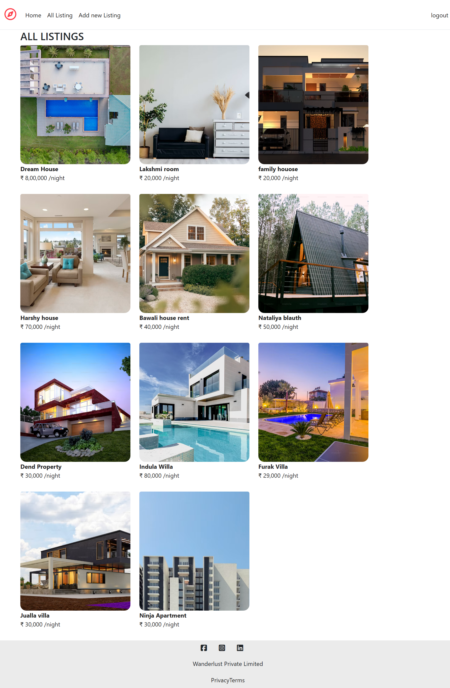
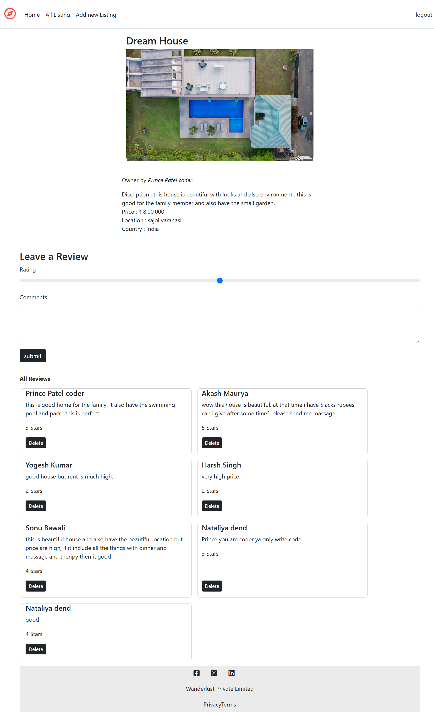
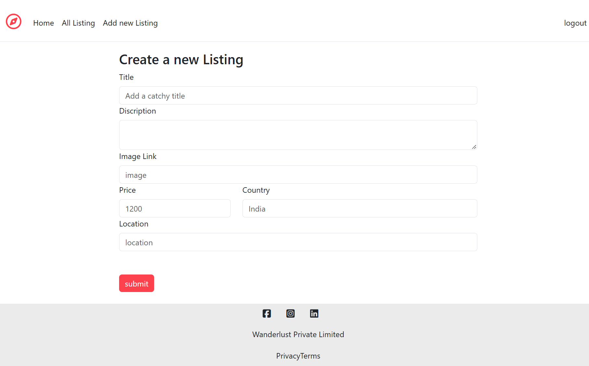
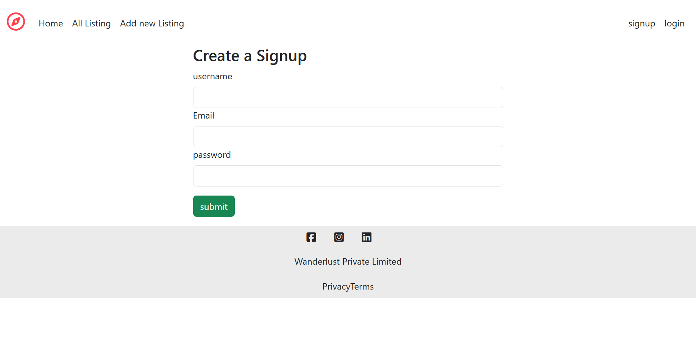

# StayNest 🏡

**StayNest — Property Rental & Listing Platform**

StayNest is a full-stack web application for creating, managing, and exploring property listings. Users can register and log in, create and manage property listings, view listing details, and add reviews.

The project is built using **Node.js, Express.js, MongoDB, Mongoose, EJS, and Passport.js**, following an **MVC architecture**.

## 🚀 Project Overview

StayNest provides a simple platform where users can:

* 👤 Create an account and log in
* 🏠 Create property listings
* ✏️ Edit and delete their listings
* 🔍 Browse available properties
* 📄 View detailed property information
* ⭐ Add reviews to listings
* 🔐 Use session-based authentication
* ⚠️ Receive validation and flash messages
* 🛡️ Handle application errors with centralized error handling

## ✨ Features

### 🔐 Authentication

* User registration and login
* Passport.js local authentication
* Session-based user authentication
* Protected user-specific operations

### 🏠 Property Listings

* Create new property listings
* View all available listings
* View individual listing details
* Edit existing listings
* Delete listings

### ⭐ Reviews

* Add reviews to property listings
* Display reviews on listing pages
* Delete reviews

### ✅ Validation & Error Handling

* Server-side input validation using Joi
* Custom error handling with Express middleware
* 404 handling for unavailable routes
* Flash messages for success and error notifications

### 🗄️ Database

* MongoDB for data storage
* Mongoose for database modeling and queries
* Separate models for users, listings, and reviews

### 🎨 Server-Side Rendering

* EJS templates for dynamic pages
* EJS-Mate for reusable layouts
* Reusable navbar, footer, and flash-message components

## 🛠️ Tech Stack

### Frontend

* HTML5
* CSS3
* JavaScript
* EJS
* EJS-Mate

### Backend

* Node.js
* Express.js

### Database

* MongoDB
* Mongoose

### Authentication

* Passport.js
* Passport-Local
* Express-Session

### Validation & Middleware

* Joi
* Method-Override
* Connect-Flash

### Development Tools

* Git
* GitHub
* VS Code

## 📁 Project Structure

```text
StayNest/
│
├── controllers/
│   ├── listings.js
│   ├── reviews.js
│   └── users.js
│
├── models/
│   ├── listing.js
│   ├── review.js
│   └── user.js
│
├── routes/
│   ├── listing.js
│   ├── review.js
│   └── user.js
│
├── views/
│   ├── layouts/
│   ├── includes/
│   ├── listings/
│   └── users/
│
├── utils/
│   ├── expressError.js
│   └── wrapAsync.js
│
├── init/
│   ├── data.js
│   └── index.js
│
├── public/
│
├── index.js
├── package.json
├── package-lock.json
├── .gitignore
└── README.md
```

### 🏗️ Architecture

StayNest follows the **MVC (Model-View-Controller)** architecture:

```text
                    ┌──────────────┐
                    │    Browser   │
                    └──────┬───────┘
                           │
                           ▼
                    ┌──────────────┐
                    │    Routes    │
                    └──────┬───────┘
                           │
                           ▼
                  ┌─────────────────┐
                  │   Controllers   │
                  └────────┬────────┘
                           │
                           ▼
                    ┌──────────────┐
                    │    Models    │
                    └──────┬───────┘
                           │
                           ▼
                    ┌──────────────┐
                    │    MongoDB   │
                    └──────────────┘

Controllers → EJS Views → Browser
```

### 🔄 Request Flow

1. User sends a request from the browser.
2. Express routes receive and direct the request.
3. Controllers handle the application logic.
4. Mongoose models interact with MongoDB.
5. Controllers send data to EJS templates.
6. EJS renders the final HTML page.
7. The response is sent back to the browser.

## 📸 Screenshots
### 🏠 All Listings

### 🏡 Property Details & Reviews

### ➕ Create New Listing

### 🔐 User Registration



## ⚙️ Installation & Setup

### 1. Clone the Repository

```bash
git clone https://github.com/princepatel2003/StayNest.git
cd StayNest
```

### 2. Install Dependencies

```bash
npm install
```

### 3. Start MongoDB

Make sure MongoDB is running locally on your system.

StayNest currently connects to:

```text
mongodb://127.0.0.1:27017/staynest
```

### 4. Start the Application

```bash
node index.js
```

The application will start on:

```text
http://localhost:8080
```

### 5. Open in Browser

Visit:

```text
http://localhost:8080
```

### 🔑 Environment Variables

For production, sensitive configuration such as the MongoDB connection string and session secret should be stored in environment variables rather than directly in the source code.

Example:

```env
MONGO_URL=your_mongodb_connection_string
SESSION_SECRET=your_session_secret
```


## 📚 Key Concepts Demonstrated

Through StayNest, I worked with and practiced:

* **Node.js** — Server-side JavaScript runtime
* **Express.js** — Web server and routing
* **MongoDB** — NoSQL database
* **Mongoose** — Database modeling and operations
* **EJS** — Dynamic server-side HTML rendering
* **MVC Architecture** — Separation of models, views, and controllers
* **RESTful Routing** — Organized application routes
* **CRUD Operations** — Create, Read, Update, and Delete
* **Authentication** — User registration and login with Passport.js
* **Sessions** — Maintaining authenticated user state
* **Middleware** — Request processing and application-level functionality
* **Joi Validation** — Server-side input validation
* **Flash Messages** — User feedback for success and error states
* **Error Handling** — Custom errors and centralized error middleware
* **Git & GitHub** — Version control and project management


## 🚀 Future Improvements

Some improvements planned for future versions of StayNest:

* 🔎 Add advanced property search and filtering
* 🗺️ Add interactive maps and location-based search
* 📱 Improve responsive design for mobile devices
* ⭐ Add improved review and rating functionality
* 📊 Add user dashboards for managing listings and reviews
* 🛡️ Improve security and production configuration


## 👨‍💻 Author

**Prince Patel**

B.Tech Computer Science & Engineering — 2026

* GitHub: [@princepatel2003](https://github.com/princepatel2003/)
* Project: [StayNest](https://github.com/princepatel2003/StayNest)

---

⭐ If you find this project useful, consider giving the repository a star!
